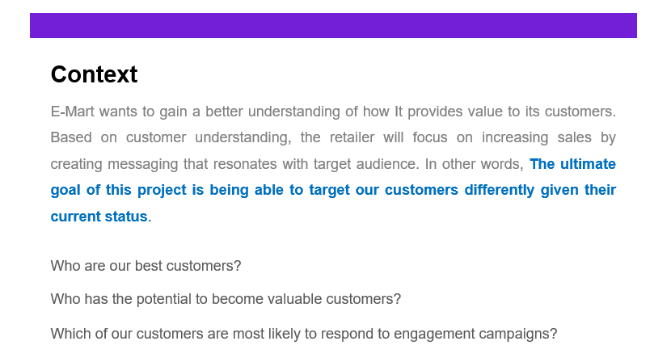
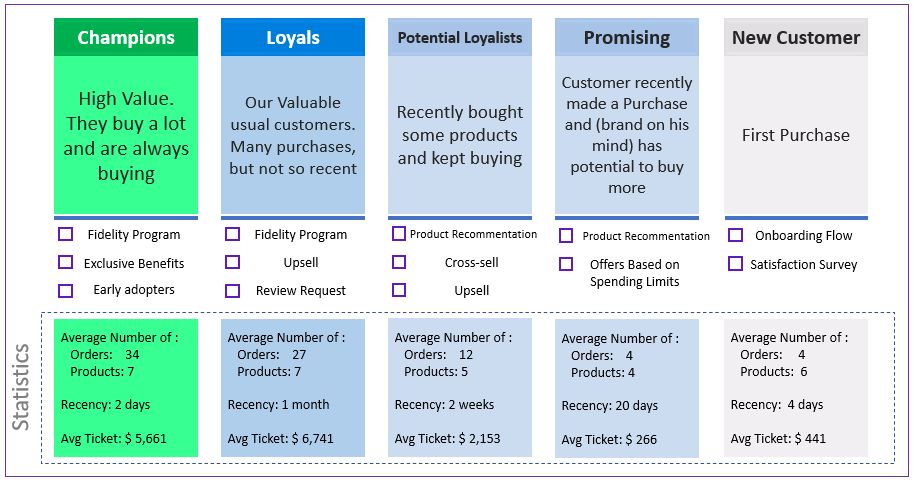
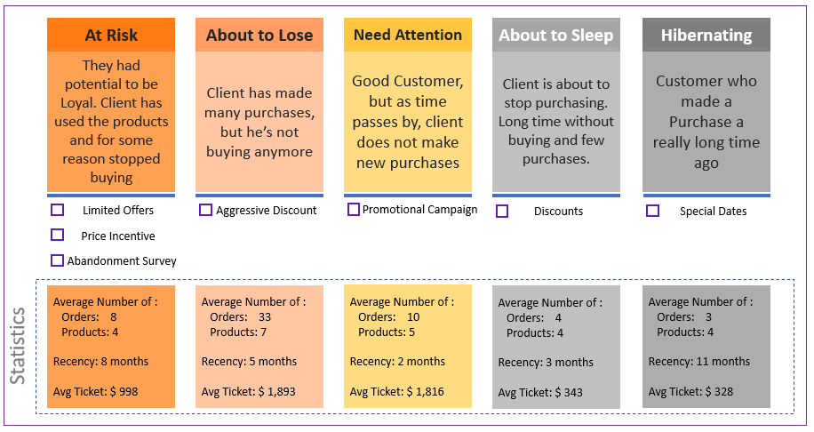
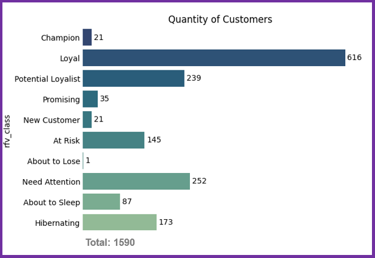
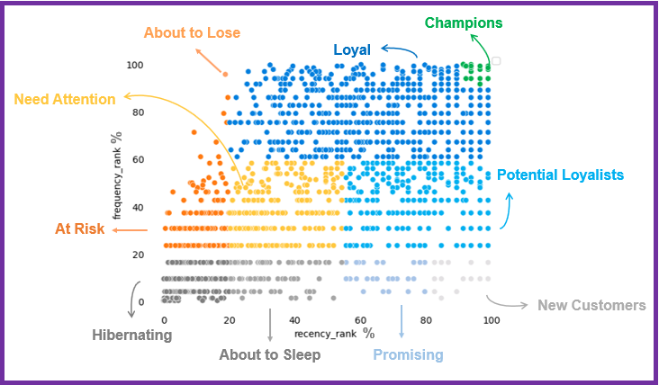
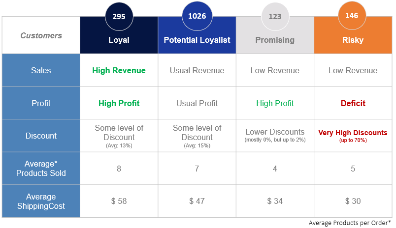
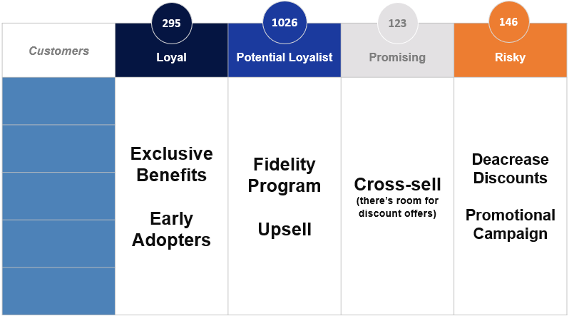
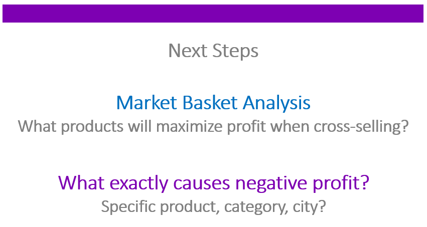

    

 

 

    

#### Agenda

[Recency Frequency Value Segmentation](#Recency-Frequency-Value-Segmentation) 

[Clustering Algorithm](#Clustering-Algorithm) 

## Recency Frequency Value Segmentation

    

 

We divided the customers into 10 clusters.

And for each group, we can use different strategic approaches, these are the groups and their respective approach strategies:

 

    

 

    

 

    

 

    

 

## Clustering Algorithm

Most Important Features: Average Sales, Average Profit, Average Discount

Next step, I used a Hierarchical Clustering Algorithm to identify most similar observations, since it’s not a big data challenge (otherwise this algorithm would slow down the process).

**The result was 4 groups:**

           One with Great ROI (Loyal).
           Another one that represents most of our customers (Potential Loyalist).
           The third one shows us potential to increase sales (Promising).
           And the last causes Deficit to the company (Risky).

 

    

 

Approaches We can use to take most out of those segments:

 

    

 

For the Next Steps, We could investigate further and add other customer characteristics to the Algorithm, creating more segments and detailing more each one of them.

 

    

 

 

---

