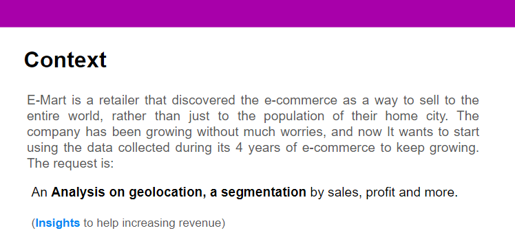
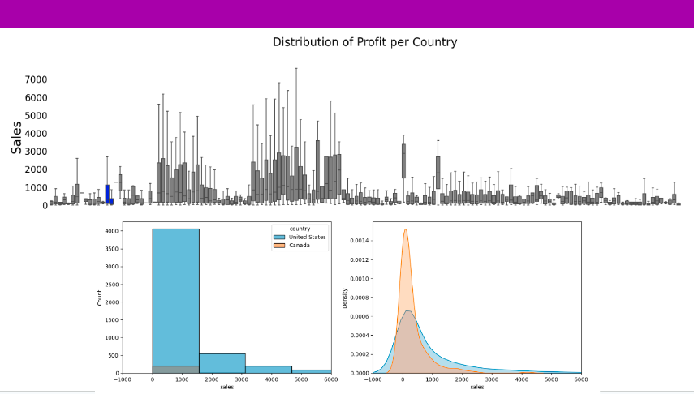
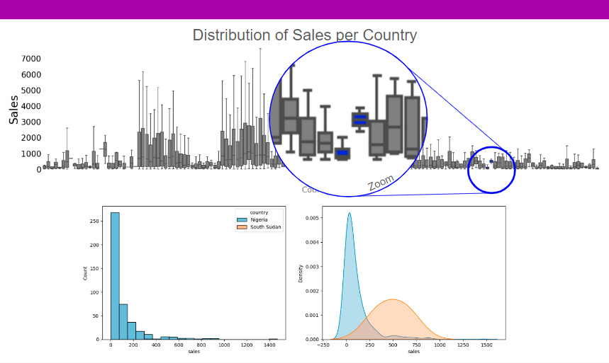
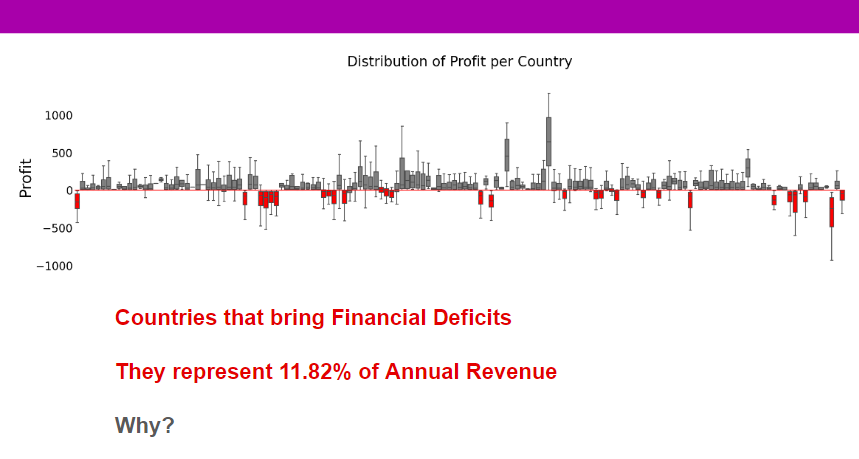
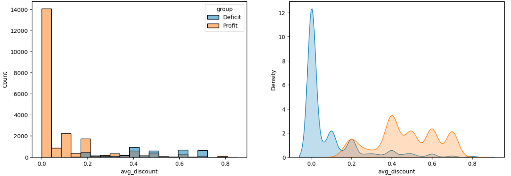
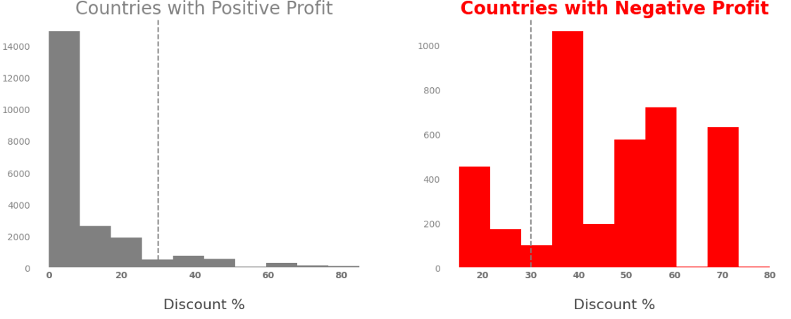

[Context](#Context) 
[Presentation](#Presentation) 
[Segmentation (Clustering Algorithm)](#Segmentation) 

## Context

E-Mart is a Chinese retailer that discovered the e-commerce as a way to sell to the entire world, rather than just to the population of their home city. The company has been growing without much worries, and now It wants to start using the data collected during its 4 years of e-commerce to keep growing and make more money.

The data can be accessed from this repository: https://github.com/pauloreisdatascience/datasets/tree/main/e_market

The company has been growing without much worries, and now It wants to start using the data collected during the years to keep growing and make more money.
At first, the board of directors expects:

- A Dashboard with KPIs to track their growth.

- Robust Data Analysis, as well as recommendation of actions. What's the actionable based on your analysis?

- **An Analysis on geolocation, a segmentation by sales, profit and more. They want insights to help increasing revenue.** 

- Sales forecast for the next year, in order to enable strategic planning.
      
### Presentation
      

    

 

 

[Google's First Rule of Machine Learning](https://developers.google.com/machine-learning/guides/rules-of-ml?hl=en): _Don’t be afraid to launch a product without machine learning._

Before applying a clustering algorithm, I looked for natural differences to generate these clusters.

For Sales, there are countries who have lower and higher sales values, but We can't really just differentiate one from another. Many of them overlap.

    

 

 

Ideally, We would like to see more differences like this:

    

 

 

Using Sales as variable of analysis "We can't really differentiate one (country) from another".

With Profit however, We can see that there are countries that bring deficit to the company (many transactions with negative profit).

    

 

 

When analyzing why this happens, I found out that most discounts in these countries are over 35%

    

    

 

 

### Segmentation

Next step, I used a Cluster Algorithm (I would use K-Means due to its velocity, but since it’s not a big data challenge I went for a Hierarchical algorithm to identify most similar observations).

 

Most important features: profitability, average discount, average profit

 

**The result was 3 groups:**

               One Focused on Sales.
               Another one with less sales but Profitable Sales.
               and the last causes Deficit to the company.

    

 

            One cluster with 13 high performance countries:
                Really great Sales (56% of Total Revenue).
                Huge Profit (52% of Total Profit).
                They represent most of our sales (60% the Number of Orders). 
                Average Profit: $ 79

            The other cluster have 105 countries:
                An Average Profit higher than the high performance group ($ 109)
                but they do not buy as much (24% of Number of Orders,
                31% of Total Revenue, 28% of Total Profit)        

            The last group shows us a problem:
                29 Countries with good sales (Average Ticket similar to the high performance group...
                about $ 4,186.70), but it seems to be all in vain, because in the end of the day (year)
                They are not generating profit to the company, but deficit.
                With an Average Profit of $ -114

 

After further analysis, I was again able to see that the high discounts were likely to be the cause of this deficit.

 

    

 

So, without further ado:

 

    

 

            Extraordinary Performance? 
                Let's leverage this selling power and use cross sell,
                up sell to increase sales even more.

            Profitable Performance:
                We can also make use of cross/up sell to increase revenue.
                And here, We have a great margin for use discounts in promotions.
                (usually there are no discounts)
                The average number of product per order is 5 whereas for the 
                Extraordinary cluster it's 7. If We can increase the sales in this
                group, They might as well become Extraordinary.

            Bad Performance:
                We are already losing money here. First, We should decrease discounts
                and after, as the next step, figure out how to make profit out of this
                group. (more on this right in the next section)
                

 

Do We have losses just because of discounts? My personal hypothesis is "no". Then, the next step (if decrease discounts do not solve our problem) could be trying to uncover the real variables involved in this almost mystery.

    

 

and also... a recommendation system would help with the cross-selling strategy, but a Market Basket Analysis is simpler and may accomplish similar returns.

 

    

 

 

---
