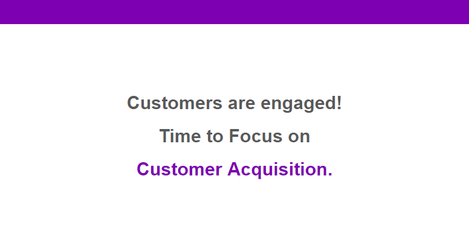

[Context](#Context) 
[Presentation](#Presentation) 
[Power Bi Dashboard](#Power-Bi-Dashboard) 

## Context

E-Mart is a Chinese retailer that discovered the e-commerce as a way to sell to the entire world, rather than just to the population of their home city. The company has been growing without much worries, and now It wants to start using the data collected during its 4 years of e-commerce to keep growing and make more money.

The data can be accessed from this repository: https://github.com/pauloreisdatascience/datasets/tree/main/e_market

The company has been growing without much worries, and now It wants to start using the data collected during the years to keep growing and make more money.
At first, the board of directors expects:

- **A Dashboard with KPIs to track their growth.**

- **Robust Data Analysis, as well as recommendation of actions. What's the actionable based on your analysis?**

- **An Analysis on geolocation, a segmentation by sales, profit and more. They want insights to help increasing revenue.** 

- Sales forecast for the next year, in order to enable strategic planning.

    Questions asked by Managers

      How is the revenue growth and what's the growth rate?

      How many orders do we receive each month?

      Has the conversion rate been increasing in recent years?

      What is our repurchase rate and how many new customers have we received?

      How often do our customers make a purchase and what is the average amount spent on each purchase?

      What is our current churn rate (customers who haven't purchased for more than 90 days)?
      
      
### Presentation
      

    

 

 

There are 4 years of data in which we acquired approximately 1,500 Customers and 25,000 Orders

    

 

 

    

 

 

    

 

 

    

 

 

    

 

 

    

 

 

In other words, all of this indicates that customers are engaged and we can focus on acquiring more customers to increase revenue, because we know there is potential for repurchases.

    

### Power Bi Dashboard

    

**Revenue Growth Rate**

    How fast are We growing?

**Number of Orders**

    What is our ability to generate purchasing opportunities?
    

**Repurchase Rate**

    How many customers continue to buy?
    

**Number of New Customers**

    Tracking Customer Acquisition. Is our Marketing Strategy 
    (organic or not) working?
    

**Average Order Value**

    Average amount of money a customer spends per transaction. 
    It’s a key KPI because it helps measure how well We capitalize on cross-selling and
    upselling opportunities.
    
    Increasing average order value is one of the most efficient ways to increase ecommerce
    revenue. And, generally, the higher the AOV, the more We can spend to acquire a new customer.
    
    
**Average Profit**

    The more profit We can get out of a customer, the more We can afford to spend on acquiring 
    a customer or even reinvesting in other areas of the company.. 

    “For example, if each customer on average is worth 1,000 to you, you can afford to spend 
    anything below 1,000 to be profitable. Whereas if a competitor’s average profit per customer
    is only 200, they can’t spend anything above 200, but you can because each customer is worth more.”

**Profit Margin**

    It Measures The Profitability Of A Business

