

  

[pr_v01_geographic_segmentation.ipynb](https://github.com/pauloreis-ds/e_mart_retailer/blob/main/project_country_segmentation/notebooks/pr_v01_geographic_segmentation.ipynb)  
[pr_v01_geographic_segmentation_analysis.ipynb](https://github.com/pauloreis-ds/e_mart_retailer/blob/main/project_country_segmentation/notebooks/pr_v01_geographic_segmentation_analysis.ipynb)  

  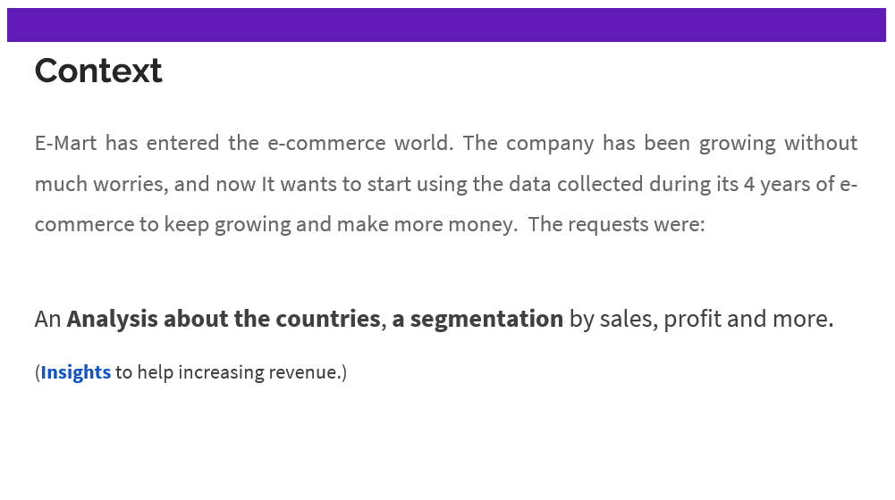

[Google's First Rule of Machine Learning](https://developers.google.com/machine-learning/guides/rules-of-ml): _Don’t be afraid to launch a product without machine learning._

Before applying a clustering algorithm, I looked for natural differences to do this clustering.

For Sales, there are countries who have lower and higher sales values, but We can't really differentiate one from another. Many of them overlap.

  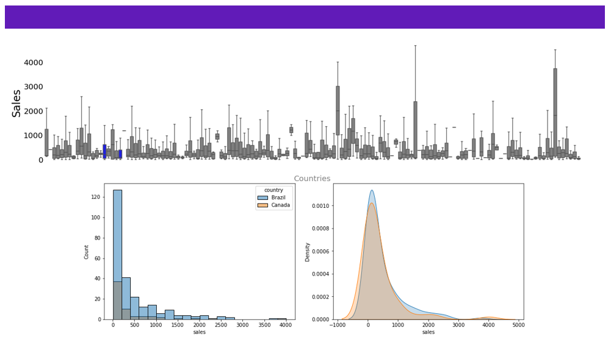

Ideally, We would like to see more differences like this:

  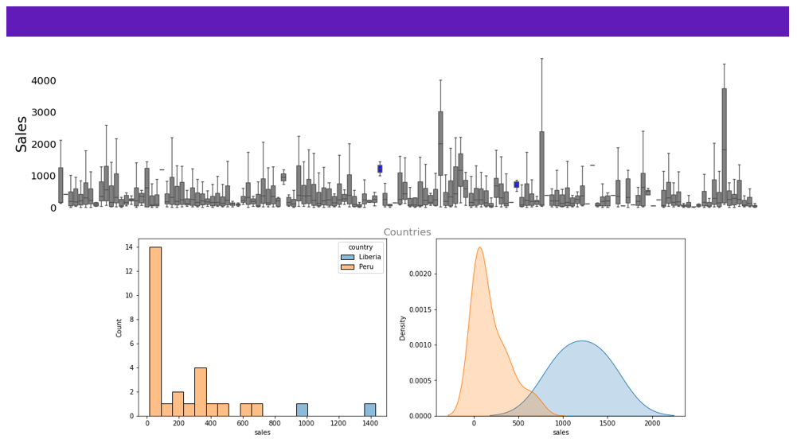

Using Sales as variable of analysis "We can't really differentiate one (country) from another."

With Profit however, We can see that there are countries that bring deficit to the company (transactions with negative profit).

  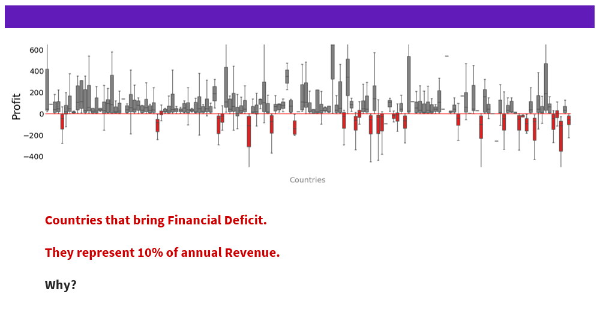

When analyzing why this happens, I found out that most discounts in these countries are over 35%

  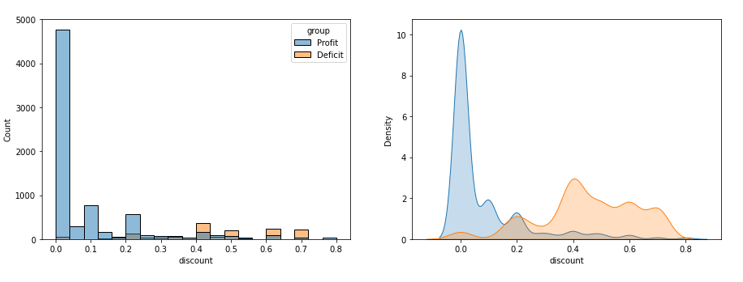

  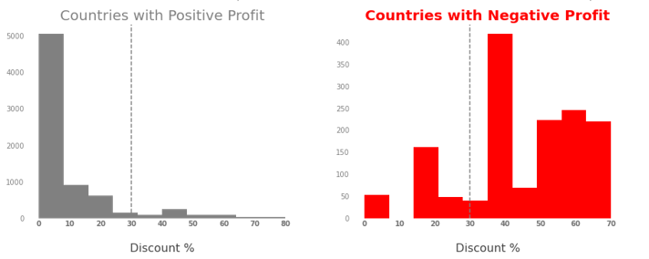

Next step, I used a cluster algorithm (K-Means first due to its velocity).  
Features = Profit, Sales, Discounts.  

**The result was 3 groups:**

  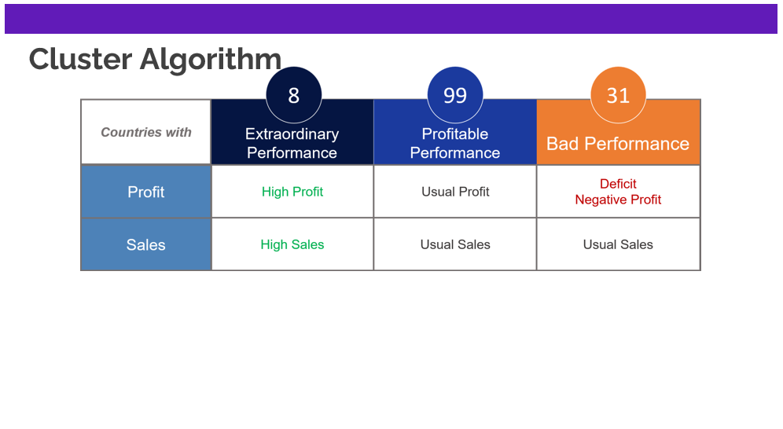

    One cluster with 8 high performance countries:
        Really great Sales.
        Huge Profit.
        They represent most of our sales (49%). 
    
    The other cluster have 99 countries:
        They are profitable and We could see them as Loyal Customers, so to speak.

    The last group shows us a problem:
        31 Countries with good sales (similar to the Profitable group), 
        but it seems to be all in vain, because in the end of the day (year)
        They are not generating profit to the company, but deficit.
        

After further analysis, I was again able to see that the high discounts were likely to be the cause of this deficit. 

  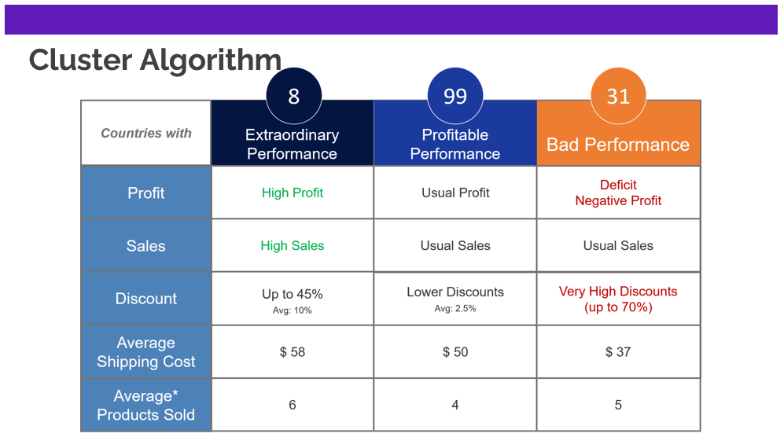

So, without further ado:

    Extraordinary Performance? 
        Let's leverage this selling power and use cross sell,
        up sell to increase sales even more.

    Profitable Performance:
        We can also make use of cross/up sell to increase revenue.
        And here, We have a great margin for use discounts in promotions.
        (discounts are usually 2.5%)
        The average number of product per order is 4 whereas for the 
        Extraordinary cluster it's 6. If We can increase the sales in this
        group, They might as well become Extraordinary.

    Bad Performance:
        We are already losing money here. First, We should decrease discounts
        and after, as the next step, figure out how to make profit out of this
        group. (more on this right in the next section)

  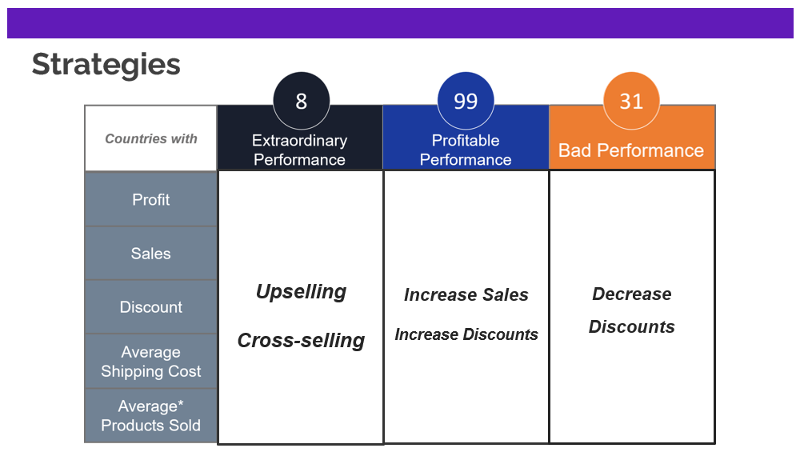

Do We have losses just because of discounts? I don't think so. Then, the next step could be trying to uncover the real
variables involved in this almost mystery.

  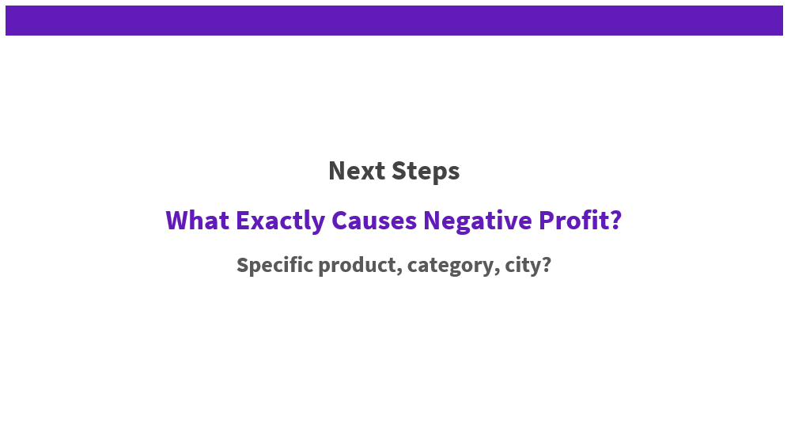

and also... a recommendation system would help with the cross-selling strategy, but a Market Basket Analysis is simpler 
and may accomplish similar returns. 

  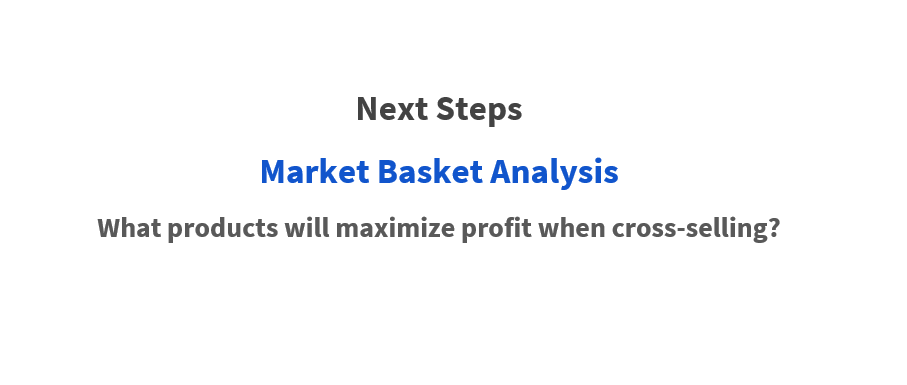

_ps: I analyzed data from last year (2014) to work with the most current data._

---