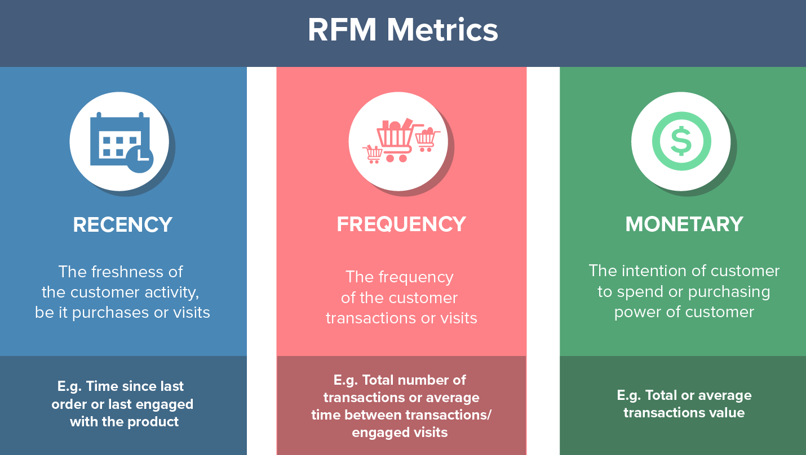

  

  

### Agenda 

[Recency Frequency Value Segmentation](#Recency-Frequency-Value-Segmentation) 

[Clustering Algorithm](#Clustering-Algorithm) 

## Recency Frequency Value Segmentation

  

We divided the customers into 10 clusters.

In short, these are the groups and their respective approach strategies:

  

  

_About to Lose: even though this category is here, there are no customers
classified as "About to Lose" during the period of analysis (2014)_

For a more  quantitative view:

  

  

## Clustering Algorithm

_Features: Sales, Profit, Discount and Shipping Cost._

For the clustering task I started with K-Means due to its runtime, and found 4 main clusters:

  

However, there's still a fifth cluster, which We have to take a closer look to understand what's going on in there.

  

  

  

  

---
