

  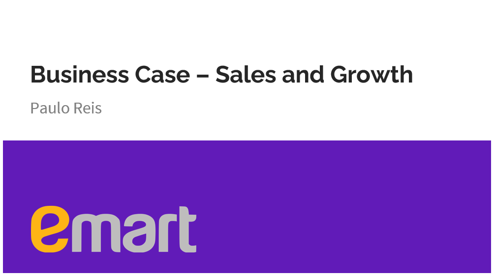

    

[pr_v01_growth_eda.ipynb](https://nbviewer.org/github/pauloreis-ds/e_mart_retailer/blob/main/project_growth_dashboard/notebooks/pr_v01_growth_eda.ipynb)

[Power BI Dashboard](https://youtu.be/3pxnHZv4ywY)

  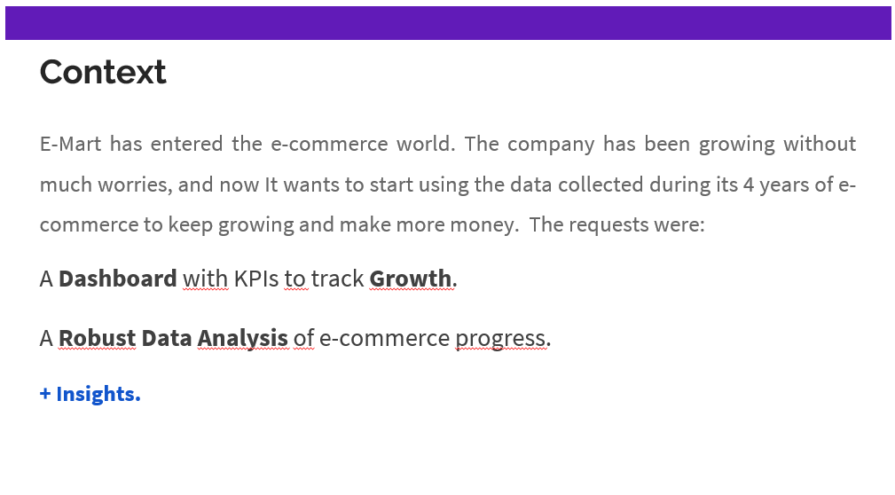

   

There are 4 years of data in which we acquired approximately 1,500 Customers and 25,000 Orders

  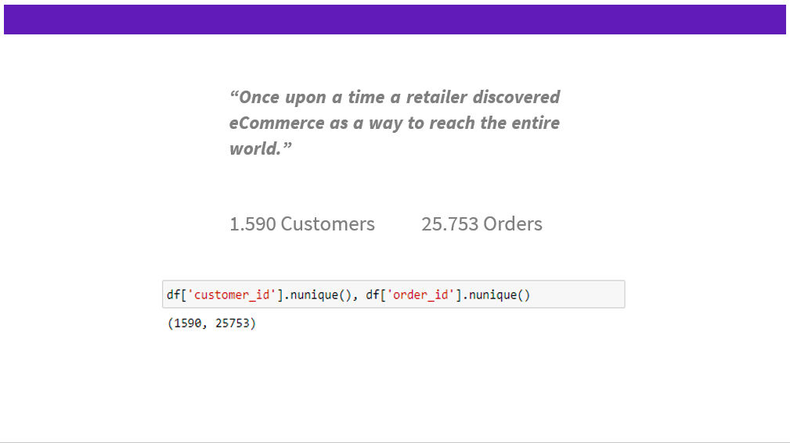

  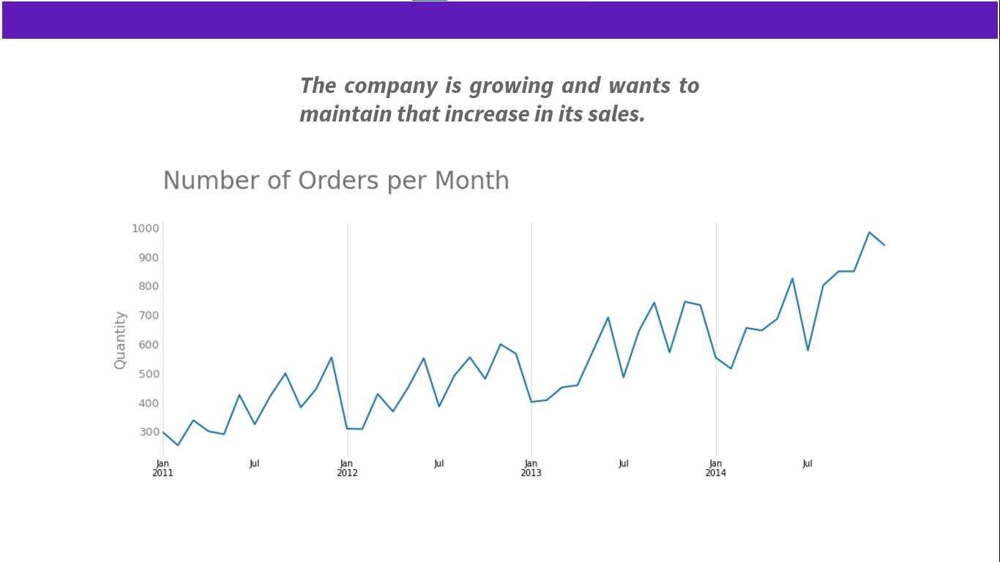

Revenue Growth Rate has been positive every year 

  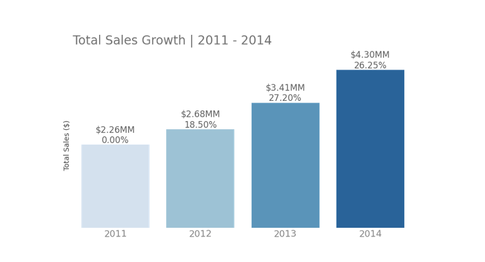

And last year (2014) we had a growth in revenue equivalent to a growth of 4% per month.

  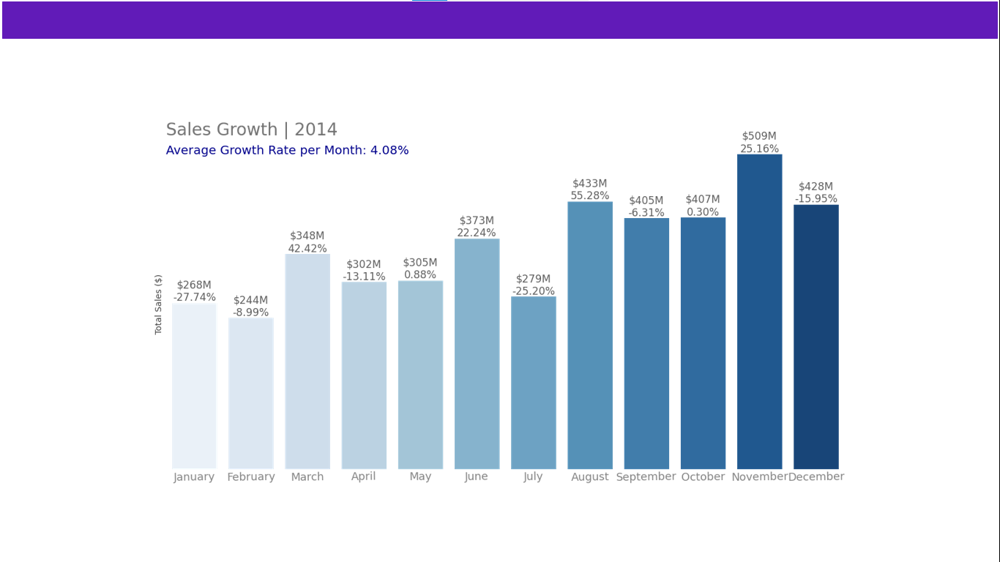

But even though sales are increasing, the number of new customers each period has been decreasing.

(Which in our case means that the repurchase rate is increasing)

  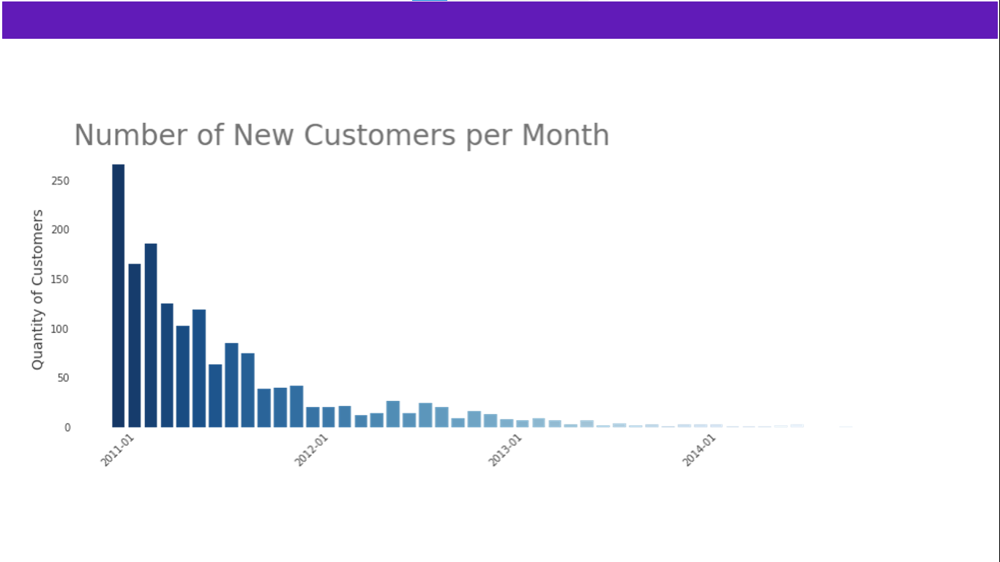

In the middle of the 1st year of E-commerce, we had already managed to acquire 60% of customers for the next 3 and a half years.

  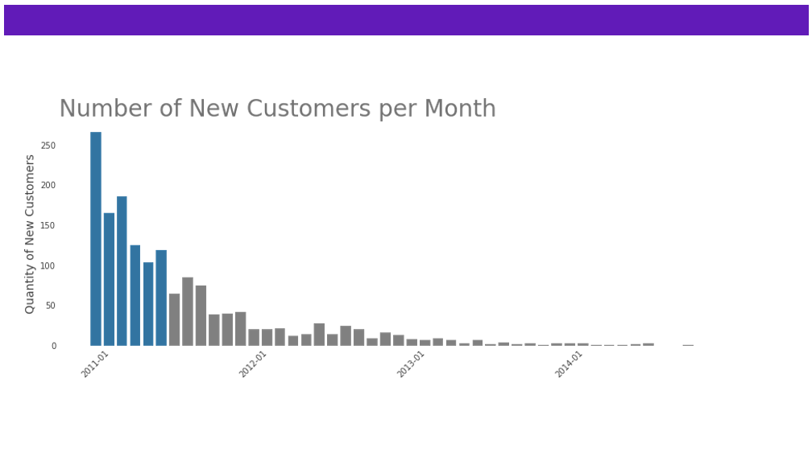

And even with fewer and fewer new customers, sales was (and is) still growing. As I said: repurchase rate is increasing.

  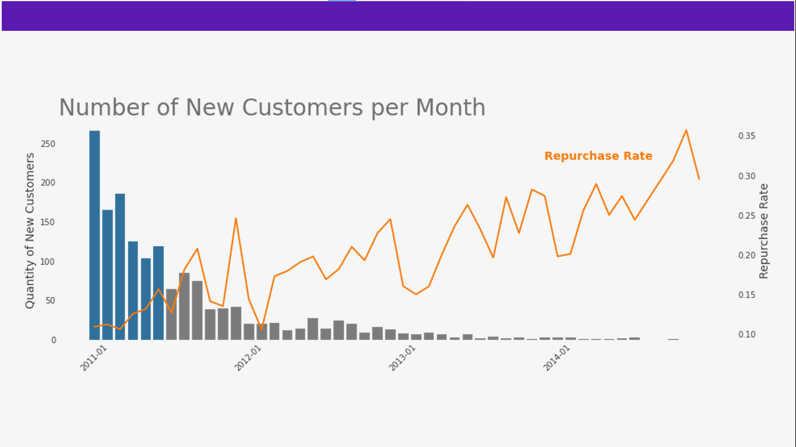

In other words, all of this indicates that customers are engaged and we can focus on acquiring more customers to increase revenue,
because we know there is potential for repurchases.

  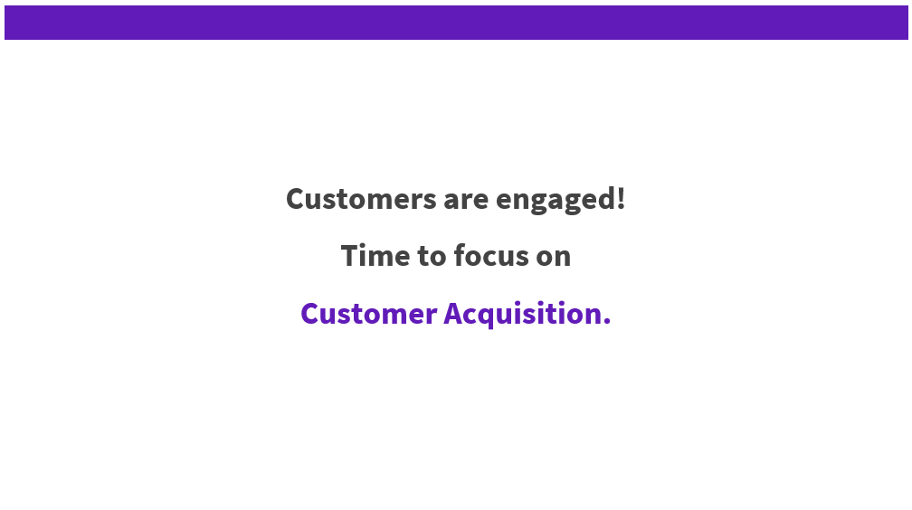

Finally, [Power BI Dashboard](https://youtu.be/3pxnHZv4ywY):

_Light Theme:_

  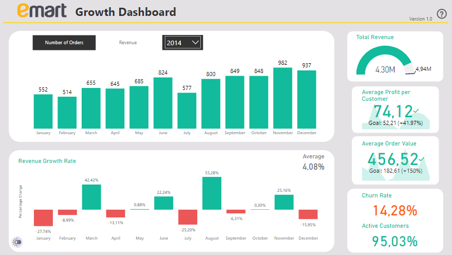

_Dark Theme:_

  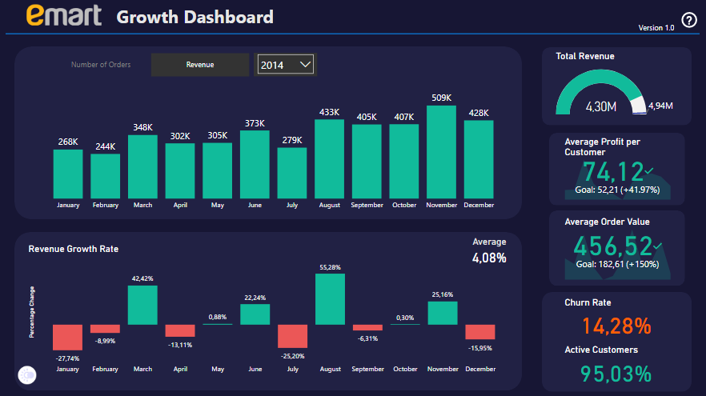

### Why?

**Total Sales**
        
        How much money our business makes from all the products and services sold.
        It tells us exactly how much money our business generates before expenses.

**Revenue Growth Rate**

        It measures the month-over-month percentage increase in revenue
        and provides a solid indicator of how quickly the company is growing.

        
**Number of Orders**

        It represents an indicator of our ability to generate sales opportunities.
        When analyzed in the context of Active Customers, the Number of Orders provides an 
        indicator of our ability to attract recurring purchases and also the effectiveness
        of our targeted advertising.

**Average Order Value**

        Average amount of money a customer spends per transaction. 
        It’s a key KPI because it helps measure how well We capitalize on cross-selling and
        upselling opportunities.
        
        Increasing average order value is one of the most efficient ways to increase ecommerce
        revenue. And, generally, the higher the AOV, the more We can spend to acquire a new customer.
                
        
        
**Average Profit Per Customer**

        The more profit We can get out of a customer, the more We can afford to spend on acquiring 
        a customer or even reinvesting in other areas of the company.. 

        “For example, if each customer on average is worth 1,000 to you, you can afford to spend 
        anything below 1,000 to be profitable. Whereas if a competitor’s average profit per customer
        is only 200, they can’t spend anything above 200, but you can because each customer is worth more.”
        
        
        
**Active Customers Rate**

        The point behind tracking active users is to make sure that the product is providing
        continuing value to users.

**Churn rate**

        It provides clarity on how well the business is retaining customers, which is a reflection
        on the quality of the service the business is providing, as well as its usefulness.