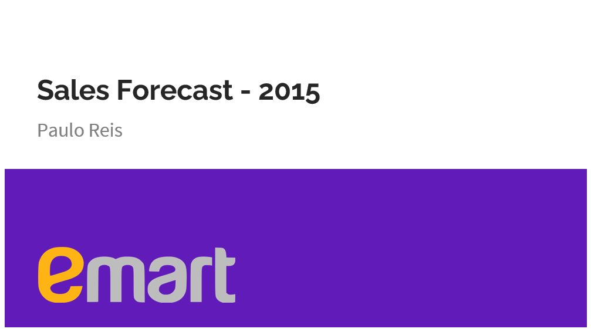
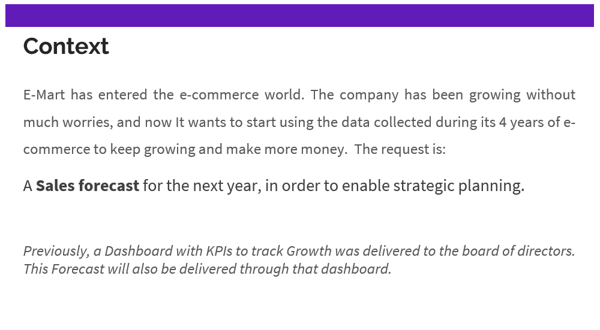
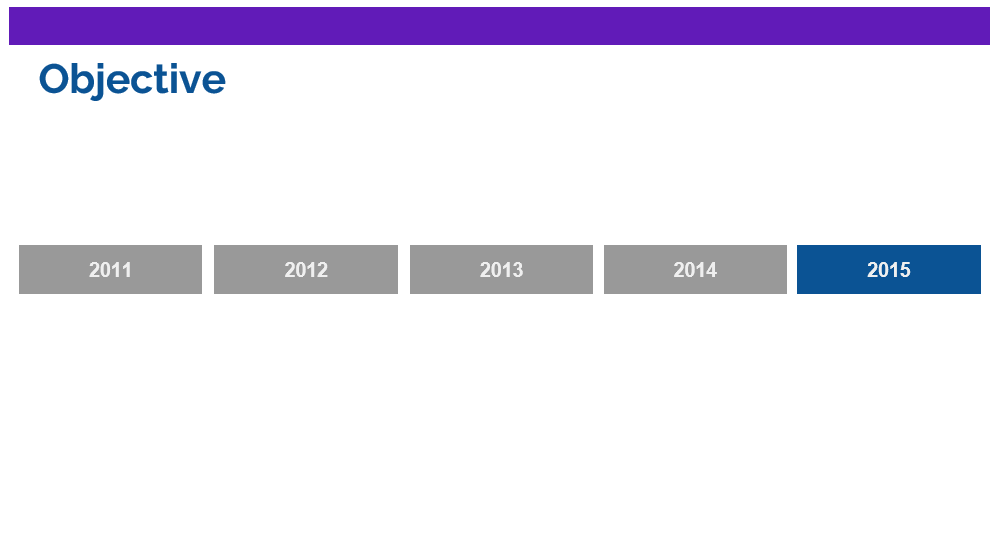
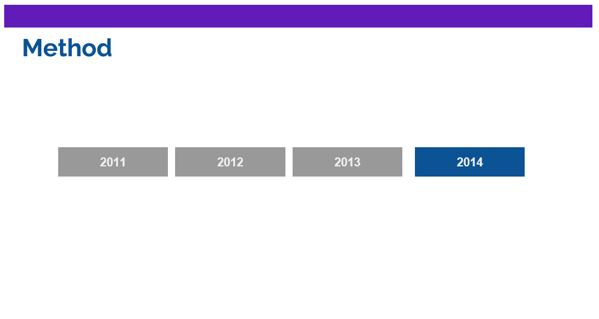
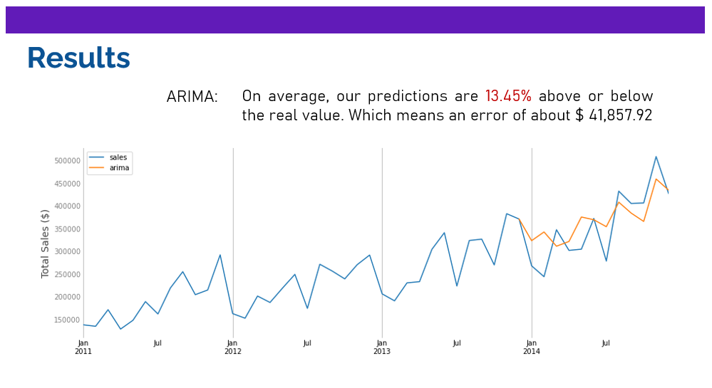
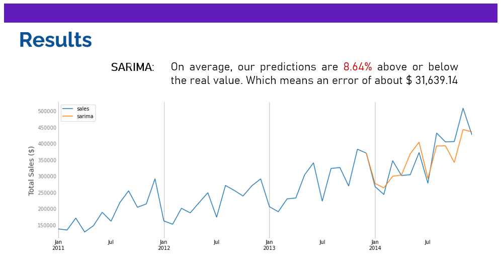
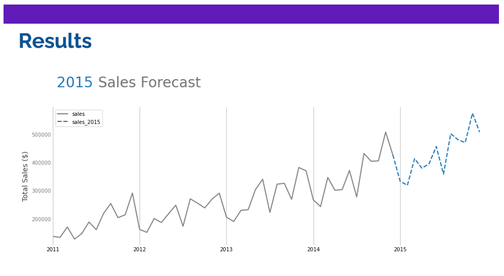
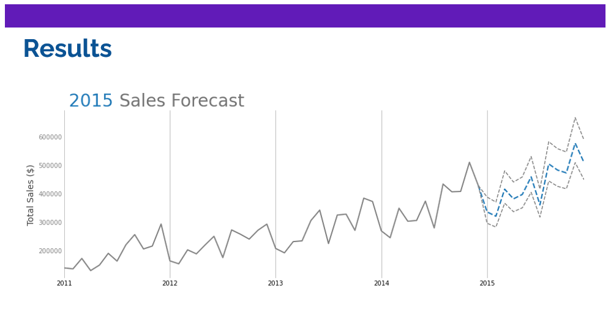
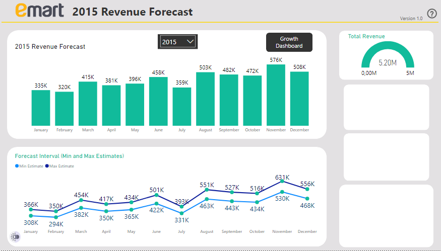

  

  

[.ipynb]()

[Power BI Dashboard](https://youtu.be/3pxnHZv4ywY)

  

Our objective is to predict sales revenue for each month of 2015

  

I used 2014 as a test, so we can analyze the model's predictive performance.

  

So, when predicting revenue of 2014... 

  

In order to better detect seasonality and improve the predictive power, I changed the model...

  

Therefore, this is the forecast for 2015 Sales:

  

However, during testing, as We got an error of 8.64%, this is our confidence interval for our estimates:

  

[Power BI Dashboard](https://youtu.be/3pxnHZv4ywY):

  

