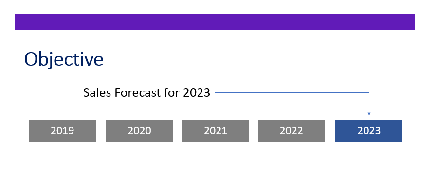
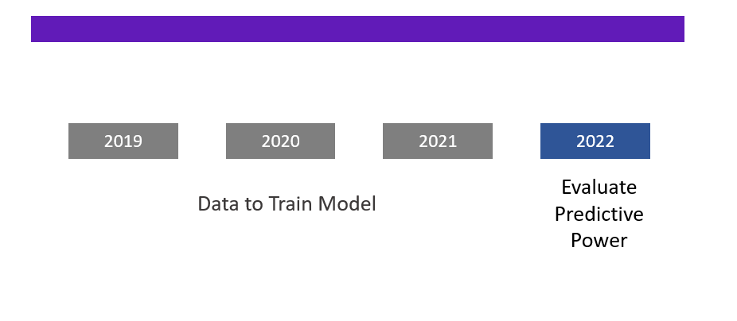
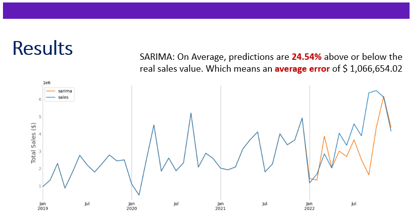
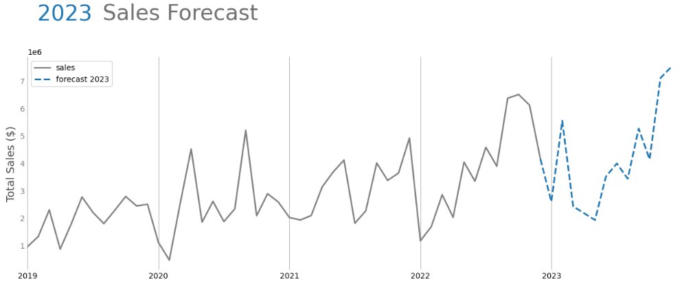
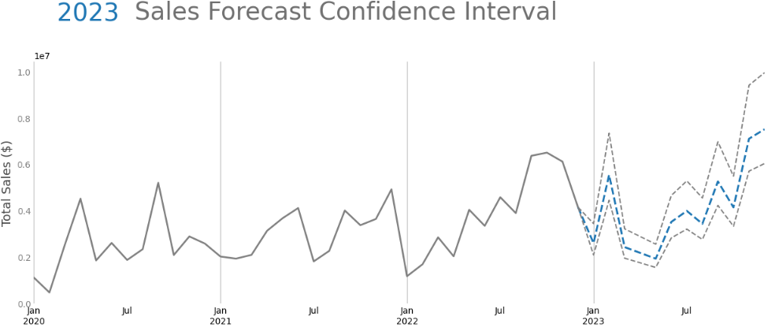

[Context](#Context) 
[Presentation](#Presentation) 
[Next Steps](#Next-Steps) 

## Context

E-Mart is a Chinese retailer that discovered the e-commerce as a way to sell to the entire world, rather than just to the population of their home city. The company has been growing without much worries, and now It wants to start using the data collected during its 4 years of e-commerce to keep growing and make more money.

The data can be accessed from this repository: https://github.com/pauloreisdatascience/datasets/tree/main/e_market

The company has been growing without much worries, and now It wants to start using the data collected during the years to keep growing and make more money.
At first, the board of directors expects:

- A Dashboard with KPIs to track their growth.

- Robust Data Analysis, as well as recommendation of actions. What's the actionable based on your analysis?

- An Analysis on geolocation, a segmentation by sales, profit and more. They want insights to help increasing revenue.

- **Sales forecast for the next year, in order to enable strategic planning.**
     

### Presentation
            

    

 

 

Our objective is to predict sales revenue for each month of 2023

    

 

 

I used 2022 as a test, so we can analyze the model's predictive performance.

    

 

 

So, when predicting revenue of 2022...

    

 

 

Therefore, this is the forecast for 2023 Sales:

    

 

 

However, during testing, as We got an error of 24%, this is our confidence interval for our estimates:

    

 

 

### Next Steps

**Strategies to Improve Model**

- Try to Forecast Weekly then group by month.

- Try using a Machine Learning Model to improve Forecast.

- Forecast Monthly Quantity of Orders, then multiply by Average Ticket.

 

 

---

